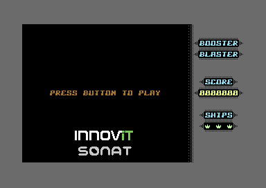

# Booster Blaster
A simple game developed in 6502 assembly for the Commodore 64 for the Booster 2022 Conference
in Bergen by John Christian Lønningdal and Ricki Sickenger



# Installation instructions

* Install Visual Studio Code

https://code.visualstudio.com/download

* Install Visual Studio Code
Open VS Code in the root folder of the repo with the . command:
```bash
code .
```

Install recommended extensions (<kbd>Ctrl</kbd>+<kbd>Shift</kbd>+<kbd>P</kbd>, "Extensions: Show Recommended Extensions")
to install the [retro studio plugin](https://marketplace.visualstudio.com/items?itemName=paulhocker.kick-assembler-vscode-ext)
If you can not find the recommendations, try installing it from the link manually.

# Attempt at automating the install

This is not perfect, the installation steps can be a bit fiddly, but this does make it a little bit more explicit and it should work.
If it does not work as intended, or if your OS is not included, try the manual steps below.
You can also borrow from the script that looks the most like your OS.

## WSL2 on Windows
This setup should work with installing on Ubuntu in WSL2.
It is using the neat litle trick of WSL's ability to run Windows programs to launch VICe.

Install dependencies. If you hava Java, comment out the line that installs the JDK first. It should be minimum version 11.
```bash
./install_deps_linux.sh
```
Modify .vscode/settings.json file paths, these must be absolute so will have to refere to location of repository.
Java is likely in the path below.

```json
    "kickassembler.javaRuntime": " /usr/bin/java",
    "kickassembler.assembler.jar": "{PATH_TO_REPO}/tools/kickass/kickassembler-5.19.jar",
    "kickassembler.emulator.runtime": "{PATH_TO_REPO}/tools/vice/bin/x64sc.exe",
```
## Windows
Installing Java on Windows is a pain. Try installing from the msi file at 
https://docs.microsoft.com/nb-no/java/openjdk/download, such as https://aka.ms/download-jdk/microsoft-jdk-11.0.15-windows-x64.msi and install it.
Remember to tick all the boxes just to be sure.

Then install dependencies from powershell using
```powershell
./install_deps_windows.ps1
```

Modify .vscode/settings.json file paths, these must be absolute so will have to refere to location of repository.
```json
    // "kickassembler.javaRuntime": "C:\\Program Files\\Java\\jre1.8.0_201\\bin\\java.exe",
    "C:\\Program Files\\Microsoft\\jdk-11.0.15.10-hotspot\\bin",
    "kickassembler.assembler.jar": "{PATH_TO_REPO}\\tools\\kickass\\kickassembler-5.19.jar",
    "kickassembler.emulator.runtime": "{PATH_TO_REPO}\\tools\\vice\\bin\\x64sc.exe"
```

## Manual steps
* Download KickAssembler and Vice (Windows) from https://www.badgerpunch.com/booster/

OR 

* Download KickAssembler from: http://theweb.dk/KickAssembler
   And unpack it in <boosterblaster-folder>/tools/kick/

* Download Vice emulator from: http://vice-emu.sourceforge.net/
   For Windows users: Unpack it in the folder <boosterblaster-folder>/tools/vice/
   For OSX users: Install it. Check if 'x64sc' is in /usr/local/bin/
   If not, we need to link it up, from /usr/local/Celler/vice/<version>/x64sc

* Optional: Add the Kick Assembler extension by Paul Hocker to VSCode:
https://marketplace.visualstudio.com/items?itemName=paulhocker.kick-assembler-vscode-ext


* Download Java JRE/JDK or just adjust settings.json to point to your Java JRE bin folder

Alternatively create another location for your tools and modify settings.json to reflect where they are.

Press F5 to compile and run if you have set up the KickAssembler extension.
Otherwise run build.bat on Windows or osx-build.sh on Mac (both assume /tools/ folder is set up)

# Folder structure:
```
bin/         Binary output folder (not part of repo, but build will create main.prg here)
lib/         Library asm files
res/         Resources like charsets and sprites
design/      Design of charsets and sprites
docs/        Some helping documents for coding
examples/    A couple of 6502 code examples
assignments/ Solutions to the 4 assignments including full game
tools/       The folder you place your tools in to use the build scripts
   
main.asm     The actual game code but with 4 empty functions as assignments
```

# Some tools we recommend

Charpad to edit character/tile sets: http://www.subchristsoftware.com/charpadfree/index.htm

Spritepad to edit sprites: http://www.subchristsoftware.com/spritepad/index.htm

Character editor for character sets (online) : https://lvllvl.com/

SpriteMate to edit sprites (online) : http://www.spritemate.com/

Pixcen to edit bitmaps: http://hammarberg.github.io/pixcen/

Paint.net to edit pixel images using layers (all tools above can import from PNG if needed): https://www.getpaint.net/

Goattracker for SID Music creation: https://csdb.dk/release/?id=152420

Exomizer for compressing program/data for unpacking on C64: https://csdb.dk/release/?id=173655

# Some useful links

An overview of the full 6502 instruction set
https://www.masswerk.at/6502/6502_instruction_set.html

A full C64 memory map explained
https://sta.c64.org/cbm64mem.html

A good site about programming for the C64
https://dustlayer.com

Great resource for code examples for doing almost anything on a C64.
https://codebase64.org

List of all KERNAL functions
https://sta.c64.org/cbm64krnfunc.html

Some ripped fonts from misc games and apps
http://kofler.dot.at/c64/font_02.html

Complete C64 BASIC and KERNAL ROM disassembly
https://www.pagetable.com/c64disasm/
